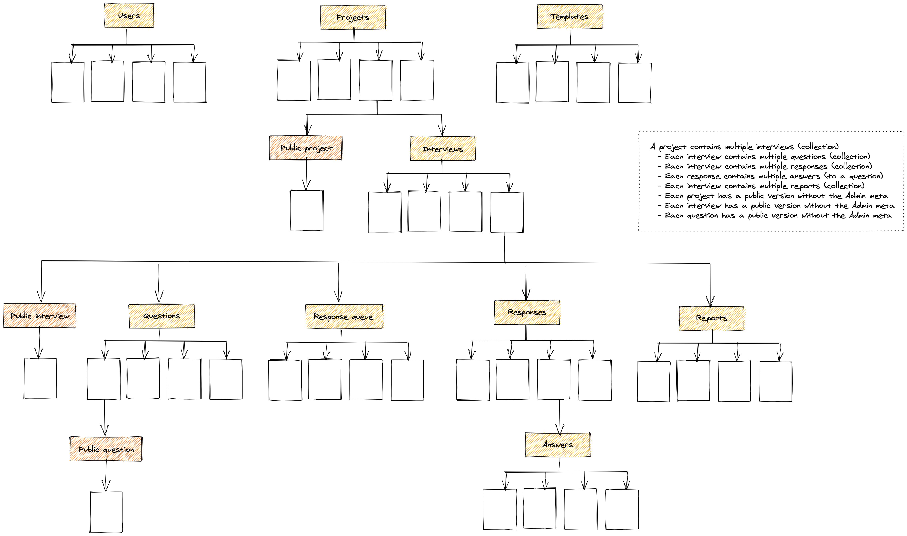

# VoiceApp - Data Hub

VoiceApp's Data Hub is a web app built using Next.js, node.js and React. It uses Firebase Firestore as the database, Firebase Functions for database triggered actions and cron jobs, and Google Cloud Platform for Firebase backups and Google Cloud translate

Find more documentation relating to security and architecture in the [docs](./docs) folder.

## Setup

To use this project, you will first need to start the development server. To do this, run the following command in your terminal:

```bash
npm run dev
```

This will start the Next.js development server. As you make changes to the code, the server will automatically reload so that you can see your changes in real time.

In order to interact with the database, you will need to provide your Firebase credentials. You can do this by copying `.env.example` to `.env` and replacing the placeholders with the appropriate values from your third party services.

## 🗄 Firebase

This project uses Firebase to manage its database and perform various backend tasks including database, authentication, cloud storage, and more.

To use Firebase with this project, you will need to create a Firebase project and set up the necessary services. Here are the general steps you can follow:

-   Create a Firebase project in the Firebase console
-   Enable the Firestore database service
-   Create a service account and download the service account key file
-   Add the necessary Firebase credentials to your project
-   Set up any necessary Firebase Functions or cron jobs

### Creating a Firebase project

To create a Firebase project, go to the [Firebase Console](https://console.firebase.google.com) and click the "Add project" button. Follow the prompts to create a new project.

### Enabling the Firestore database service

Once you have created your Firebase project, you will need to enable the Firestore database service. You can do this by going to the "Firestore Database" section of the Firebase console and following the prompts to set up your database.

### Creating a service account

To access your Firebase project from your app, you will need to create a service account and download the service account key file. You can do this by going to the "Project settings" section of the Firebase console, clicking the "Service accounts" tab, and then clicking the "Generate new private key" button. This will download a JSON file containing your service account key.

### Adding Firebase credentials

To add your Firebase credentials to your app, you will need to create an `.env` file in the root of the project and add the following variables. Follow the variables defined in `.env.example` for the naming conventions; note the use of both private (server-side) and public (client-side) keys.

> All of these variables will need defined in your chosen hosting environment too

### Firebase Functions and cron jobs

This project also uses Firebase Functions to perform various backend tasks, such as sending email notifications or storing backups. You can deploy your functions to Firebase using the Firebase CLI.

Example functions are:

-   Automatically translate question text and responses to English
-   Generate data for interview reports
-   Transform interview data once it has been completed
-   Send email notifications to new users

### Storage

We use Firebase Storage for saving generated report files (CSV or Excel) and the raw report data itself (JSON). The folder used for saving these files has rules set that forbid any access (note that we use the Data Hub API, which has access to everything, but requires authentication to use).

We also set all files to be deleted after 30 days. The configuration for that can found in `firebase-storage-rules.json` and the configuration can be set with `gsutil lifecycle set firebase-storage-rules.json gs://[bucket].appspot.com`.

See more: https://cloud.google.com/storage/docs/managing-lifecycles#command-line

Furthermore, when accessible URLs to stored files are generated, they will then expire after 10 minutes.

We have to consider the customisation options available for exporting files. Variations of these result in unique files being stored. This includes:

-   Excluded fields (these are transformed into an MD5 hash)
-   Language
-   File type

### Data

There is seed data including projects, interviews, templates, responses, and activites. This is available in the `./seed` folder.

#### Exporting data

Follow these steps to export a Firestore database so it can be imported when running the emulator.

If you need to login to the Google Cloud via CLI, follow these steps first:

1. `gcloud auth login` and follow the authentication flow
2. `gcloud projects list` to view a list of the projects on your account

Once you have logged-in and have your project ID:

1. `gcloud config set project voiceapp-test`
2. `gcloud firestore export gs://voiceapp-test.appspot.com/firestore_export`
3. `gsutil -m cp -R gs://voiceapp-test.appspot.com/firestore_export seed/` (**NB:** This may delete existing files in the seed folder, make sure to revert these if they are)

> **NB:** You should replace `voicapp-test` with the name you used when setting up the project in GCP (we also recommend using a different project for testing)

You can then run the emulator preloaded with the data:
`firebase emulators:start --import ./seed`

You can also update the Cypress fixtures using the data from the seed with:
`yarn generate-fixtures`

> **NB:** By default we're using the "firestore_export" name for the folder. If this already exists the export may fail. Simply use a different target folder. You can also delete existing buckets via [Google Cloud Platform](https://console.cloud.google.com/storage/browser/). We could also [simplify this further](https://medium.com/firebase-developers/how-to-import-production-data-from-cloud-firestore-to-the-local-emulator-e82ae1c6ed8).

> **NB:** If you're going to export new data as the seed data, take a back up of the original file using `yarn db:backup`.

### Emulators

For testing and CI we use the Firebase emulator to interact with Firestore and Functions without affecting production data. By default we'll use the seeded data as our initial data available in the emulator, but we can also import any other inital data if needed.

To get an emulator up and running with our seed data follow these steps:

1. `yarn start:emulator` This starts the emulator, using seed data
2. `yarn db:emulator:export` This sets up Firebase SDK calls to use the emulator

#### Common errors and workarounds

`Error: ENOENT: no such file or directory ... firebase-export-metadata.json`
Firebase is expecting to read an emulator export file. [See fix](https://github.com/firebase/firebase-tools/issues/2175).

`Cannot read 'api_key'`
The credentials required by one or more Firebase Functions is missing. [See fix](https://firebase.google.com/docs/functions/local-emulator#set_up_admin_credentials_optional). Alternatively, you may have to add the secrets to the Firebase project if they've not been added.

> **NB:** If you chose to use the runtimeconfig option, make sure this is downloaded to the `./functions` folder.

**Importing database triggers Cloud Functions**

When importing a database with the local emulator, Cloud Functions triggers will be called for all data imported. To get around this, comment out all imports, start the emulator, then remove the comments.
[See more](https://stackoverflow.com/a/57060032).

**Large datasets**

The emulator did not import the production dataset (~500Mb at the time). There appears to be no clear answer on any limit, but [this comment](https://github.com/firebase/firebase-tools/issues/3289#issuecomment-827220982) indicated that an import of that size is not supported.

**Functions not found**

Make sure you are using the correct Firebase project with `firebase use [project-id]`.

### To-Dos

### Database



## Emails

Emails in the `/emails` folder have hard-coded URLs. These will need to be updated to match the URL of your new deployed app and its handbook documentation.

## 🔐 Authentication

The project uses NextAuth for handling authentication integration with Firebase. We have a custom callback for ensuring correct access because of different permission types between the Data Hub and App.

### CSS

We use [Tailwind](https://tailwindcss.com/) for styling the app.

### Deploying / Publishing

To deploy this project, you will need to first build the production version of the project using the command:

```bash
npm run build
```

To deploy this project to Vercel, you can follow these steps:

-   Fork this repository on GitHub or create a new project on Vercel's dashboard.
-   Connect your Vercel project to your GitHub repository.
-   Set up your environment variables by going to your Vercel project dashboard, clicking on the "Settings" tab, and then clicking on the "Environment Variables" section. Add the necessary environment variables, such as your Firebase credentials.
-   Customize your build settings by going to your Vercel project dashboard, clicking on the "Settings" tab, and then clicking on the - "Build & Deploy" section. Here you can specify your build settings, such as the build command (npm run build) and the output directory (out).
-   Deploy your app by clicking the "Deploy" button in your Vercel project dashboard.

That's it! Vercel will automatically build and deploy your app using the settings you specified. Once the deployment is complete, you can access your app at the URL provided by Vercel.

Note that if you need to deploy Firebase Functions or cron jobs, you will need to set those up separately using the Firebase CLI.

## Roadmap

Voice App Data Hub has been developed on and off for a number of years and we are now looking to make it more widely available and to continue to develop it.

As with all projects of this stature, there are a number of features that we would like to add and improvements that we would like to make.

-   State management uses Recoil. Development has stalled since it was first introduced and we suggest migrating to using Jotai instead.
-   Firebase should be upgraded to use the new namespace architecture introduced in version 9. This will require a bit of refactoring but should reduce the bundle size and some complexity.
-   Reporting should be improved to allow for more granular reporting and to allow for more customisation. Right now there is also some duplication of code between the Data Hub API and the Firebase Functions implementation. This was migrated to Firebase Functions after we hit some roadblocks with Next.js API on Vercel with long-running functions.
-   Authentication should be improved to allow for more granular permissions for users and projects. Right now we have a single permission level for all users and projects.
-   Authentication integration for Firebase Authentication and NextAuth.js could be improved also.
-   Testing with Firebase Emulator and Cypress is currently more complex than it hopefully could be. We should look to simplify this process.
-   There are a number of other improvements that could be made to the API to reduce boilerplate for common Firebase operations.
