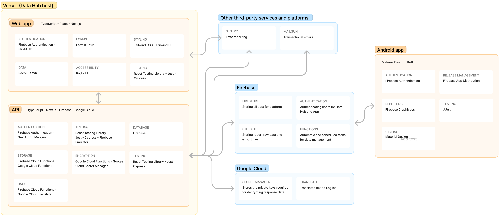

# Data Hub

The VoiceApp’s Data caters for both the functional and security requirements of the platform. The primary technologies used to build the Data Hub is Node.js, for server-side functionality, and React, for building the client-side UI. We remove a lot of the legwork of getting the application up and running by using tools provided by Vercel and Firebase.

The underlying language across the client and API is TypeScript, a superset of JavaScript that adds support for static types. This provides an advanced set of features that allow developers to describe their code in a way that allows us to self-document the code and increase predictability and reasoning through features like suggestions, code completion, refactoring, and more. As the codebase grows it means we catch bugs and errors before they can even be released to production. We use TypeScript to write the client-side application code for the browser and on the server-side for APIs, authentication, and database interactions. This is what makes the choice of TypeScript so powerful as it provides built-in and generated information about our markup, interactions, styling, data structures, database schemas, and more, all within our code editor.

## Vercel

Vercel is a company who specialise in creating tools and services focused on easy and universal access for developers and their users.

### Data Hub UI

We use Vercel’s open source Next.js framework for building the Data Hub site. Next.js is a
framework for building web applications with React and includes features such as seamless
server and/or client-side rendering, routing, advanced performance and UX, simple
configuration and deployment, and much more. This also allows us to utilise our existing
tools and libraries to rapidly build our UI and data integrations.

Next.js’ built-in support for API routing is used to offload work to server-side integrations for features like interview post-processing and triggering emails. The API is only accessible to users authenticated and authorised with the Data Hub and is only used to supplement Data Hub requirements.

### Hosting

The site is hosted on Vercel’s proprietary hosting platform. Vercel is a layer in front of AWS and, with their ‘Deploy, Preview, Ship’ mantra, it allows us to continuously deliver features throughout the project using simplified configurations and management. Combined with Next.js, we have feature-rich development workflows that results in our ability to deliver great experiences to our users.

Deployments to the project can only happen via authorised users to the project or via
deployments with our automated deployment configuration (once testing and relevant
reviews have passed).

The only details stored directly on the Next.js platform are configuration information required
for the site to run. These are known as environment variables and they are stored with AES-256-CBC enhanced encryption. Once they have been added they cannot be viewed and will only be accessed when building a new version of the site.

## Firebase

Firebase is a platform that provides tools for building mobile and web apps. Firebase’s tools are tried and tested to work reliably; and do so in over a million different apps. This means we spend less time building these features from scratch and instead focus our efforts on building new features.

It is worth noting that no product or personal data is be stored or hosted on Vercel. As with the App, all platform data is stored in and delivered securely via the official Firebase development kits.

As well as simplifying our approach by having a single datastore with well-documented access, we use their widely-available and best-practice authentication, storage and and cloud functions.

Firebase is a Google product.

### Authentication

Firebase provides a plethora of options for authenticating and registering users. We use their credentials-based authentication, combined with custom user profiles for managing role-based access and more.

### Firestore

We use Firestore as our database. Firestore is a document database that is well-suited to our ambitions to scale and deliver the VoiceApp globally. Although the database is used by both the Data Hub and App, there are powerful built-in security features that mean we can easily restrict certain actions to specific users and access groups.

### **Cloud Functions**

Cloud Functions are primarily used as document triggers. This means that when, for example, a interview response is submitted to the response queue, a Cloud Function is triggered to deal with decryption of the data. We use Cloud Functions for on-demand tasks like generating reports, or automated tasks such as data backups or translation of text content.

### Storage

Storage is used for storing report data that is generated for interviews. We cache this data to reduce database reads, but the document size limits in Firestore mean we have to store the raw data in Storage instead of Firestore.

### Analytics

We use both the app and web versions of Analytics. This is required to track
page/screen views and event tracking. Useful insights will also be provided such as dwell
time and browser/device type.

### Crashlytics

This tool allows us to track and monitor bugs that happen in the App. This gives us logs
and insights to any errors that happen, allowing us to quickly track, debug, and then fix
issues.

### App Distribution

We use app distribution for sharing staging apps with our internal team. These are used for testing before releasing updates to the Play Store.

## Google Cloud

We build upon Firebase’s suite of cloud services aimed at app development with some of Google’s cloud services for enhanced app features.

### Translate

We use translate for automated translations for interview content and data. For example, questions that are created for a Spanish interview are automatically translated so they can be viewed in English in the Data Hub. We also translate responses so all answers are available in English.

### Secret Manager

The private keys used for decrypting interview data are stored in Secret Manager (the data is encrypted on the app using our public key). These keys cannot be accessed from or are stored anywhere else.

## Other third-party services

### Sentry

Sentry is similar to Crashlytics but is better-suited to the web, so we use this for the
Data Hub site. All features remain the same in regards to logging of errors and tracing insights.

### Mailgun

We use Mailgun to deliver transactional emails when required. This include actions
such as new user invites.

# Android App

The VoiceApp enumerator app is an Android app written in Kotlin.

## Firebase

Much like the Data Hub, the Android app uses the official Firebase SDK for handling authentication and database management.

## OS Versions

Currently the Android app works on devices with Android 7.0 and greater, this accounts for
approximately 80% of the current active device.

## Devices Supported

The application is written so that it can function on Android devices that support our
supported OS versions. We will assess the chosen devices for use by VoiceApp
enumerators to understand if considerations need to be made for a lower OS version.

# Development tools

## Code management

### Github

The source code for the VoiceApp projects is stored on GitHub. We use GitHub for automated deployments. Using GitHub Actions we run all unit and integration tests ensuring all tests pass before new code is deployed. Vercel has a GitHub integration which allows for automatic deployment to preview and production URLs.
